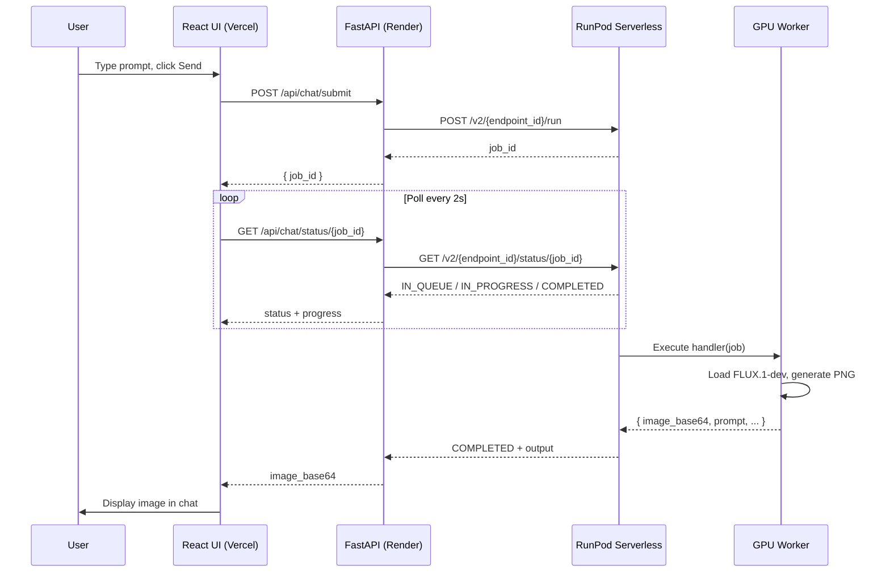
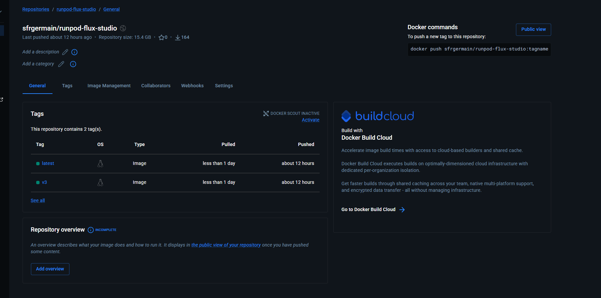
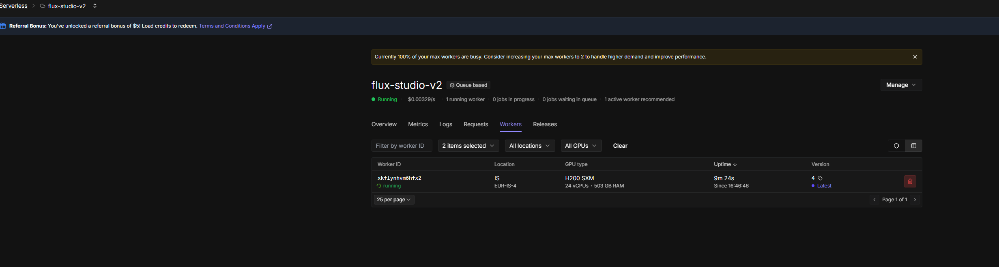

# Flux Studio — Complete Project Overview

**Author:** Germain Safari  
**Repository:** [github.com/germainsafari/Runpod](https://github.com/germainsafari/Runpod)  
**Model:** [FLUX.1-dev](https://huggingface.co/black-forest-labs/FLUX.1-dev) by Black Forest Labs  
**Platform:** [RunPod Serverless](https://www.runpod.io/serverless)

This document is a full walkthrough of the case study: what was built, how it was built, the architecture, deployment steps, and visual proof at each stage.

---

## Table of contents

1. [Executive summary](#1-executive-summary)
2. [What we set out to build](#2-what-we-set-out-to-build)
3. [System architecture](#3-system-architecture)
4. [Repository structure](#4-repository-structure)
5. [Phase 1 — Serverless GPU worker](#5-phase-1--serverless-gpu-worker)
6. [Phase 2 — Docker image on Docker Hub](#6-phase-2--docker-image-on-docker-hub)
7. [Phase 3 — RunPod Serverless endpoint](#7-phase-3--runpod-serverless-endpoint)
8. [Phase 4 — Chat application (local)](#8-phase-4--chat-application-local)
9. [Phase 5 — Web deployment (Render + Vercel)](#9-phase-5--web-deployment-render--vercel)
10. [API contract](#10-api-contract)
11. [Challenges and how we solved them](#11-challenges-and-how-we-solved-them)
12. [Performance snapshot](#12-performance-snapshot)
13. [Checklist for demo / submission](#13-checklist-for-demo--submission)
14. [Related docs](#14-related-docs)

---

## 1. Executive summary

**Flux Studio** is an end-to-end AI image generation platform:

| Layer | Technology | Role |
|-------|------------|------|
| **GPU worker** | Python + Diffusers + Docker | Runs FLUX.1-dev on RunPod GPUs |
| **API proxy** | FastAPI (Render) | Holds secrets, submits jobs, polls status |
| **Chat UI** | React + Vite (Vercel) | ChatGPT-style interface for prompts → images |

A user types a text prompt in the browser. The frontend calls our FastAPI backend, which submits an async job to RunPod Serverless. A GPU worker loads FLUX.1-dev, generates a PNG, and returns base64 image data. The UI displays the result in a chat thread — with history, library, projects, and pinning.

**Live endpoint:** `flux-studio-v2` · ID `7n4p3czd3nphae`

---

## 2. What we set out to build

The case study required:

| Deliverable | Status | Location |
|-------------|--------|----------|
| Serverless handler (`handler.py`) | Done | `serverless/handler.py` |
| Dockerfile for the worker | Done | `serverless/Dockerfile` |
| Deployed RunPod endpoint | Done | `flux-studio-v2` |
| Working inference (prompt → image) | Done | See logs + UI screenshot |
| ChatGPT-style web UI | Done | `app/frontend/` |
| API proxy backend | Done | `app/backend/main.py` |
| CLI test script | Done | `scripts/test_endpoint.py` |
| GitHub repository | Done | Public repo |
| Documentation | Done | This file + guides |

---

## 3. System architecture

### High-level flow

```
┌─────────────────┐     HTTPS      ┌──────────────────┐     HTTPS      ┌─────────────────────┐
│  React Chat UI  │ ─────────────► │  FastAPI Proxy   │ ─────────────► │  RunPod Serverless  │
│  (Vercel CDN)   │ ◄───────────── │  (Render)        │ ◄───────────── │  flux-studio-v2     │
└─────────────────┘   JSON/base64  └──────────────────┘   job polling  └──────────┬──────────┘
                                                                                    │
                                                                                    ▼
                                                                         ┌─────────────────────┐
                                                                         │  GPU Worker (Docker) │
                                                                         │  FLUX.1-dev + CUDA   │
                                                                         └─────────────────────┘
```

### Request lifecycle



### Architecture diagram (repo asset)


### Why three tiers?

| Concern | Solution |
|---------|----------|
| **API keys must stay secret** | RunPod key lives only on Render backend, never in the browser |
| **Long GPU jobs (30–300s)** | Async submit + status polling; no single HTTP request blocks for minutes |
| **Cold starts** | RunPod scales workers; `workersMin=1` keeps one GPU warm for demos |
| **CORS in production** | Backend `FRONTEND_URL` env restricts origins to your Vercel domain |

---

## 4. Repository structure

```
Runpod/
├── serverless/                 # RunPod GPU worker (Docker)
│   ├── handler.py              # Job handler: prompt → base64 PNG
│   ├── Dockerfile              # CUDA 12.4 + PyTorch + Diffusers
│   └── requirements.txt
├── app/
│   ├── backend/                # FastAPI → RunPod proxy
│   │   ├── main.py
│   │   └── requirements.txt
│   └── frontend/               # React chat UI
│       ├── src/
│       │   ├── App.jsx
│       │   ├── components/     # Sidebar, Library, Search, etc.
│       │   ├── hooks/          # useAppState (chats, projects, pins)
│       │   └── utils/          # storage, api client
│       └── vercel.json
├── scripts/
│   ├── test_endpoint.py        # CLI: submit job, save output.png
│   └── deploy.py               # Optional RunPod API deploy helper
├── docs/                       # Documentation + screenshots (this folder)
├── render.yaml                 # Render blueprint for backend
├── start.ps1                   # Local one-command startup
└── .env.example                # Environment variable template
```

---

## 5. Phase 1 — Serverless GPU worker

The worker is a Python script that RunPod invokes for each job. It loads FLUX.1-dev once (cached in memory), generates an image, and returns base64-encoded PNG data.

### 5.1 Handler design (`serverless/handler.py`)

Key design decisions:

- **Sequential CPU offload** — keeps GPU VRAM under ~2 GB at idle so 24 GB cards can run inference
- **Default 512×512** — safe resolution for memory-constrained GPUs
- **VAE slicing/tiling** — further reduces peak memory during decode
- **Version marker** — `[v3-sequential-offload]` appears in logs for debugging

```python
HANDLER_VERSION = "v3-sequential-offload"

def load_model():
    pipeline = FluxPipeline.from_pretrained(
        "black-forest-labs/FLUX.1-dev",
        torch_dtype=dtype,
        token=os.environ.get("HF_TOKEN"),
        low_cpu_mem_usage=True,
    )
    pipeline.enable_sequential_cpu_offload()
    pipeline.vae.enable_slicing()
    pipeline.vae.enable_tiling()
    return pipeline

def handler(job):
    prompt = job["input"]["prompt"]
    image = model(prompt=prompt, width=512, height=512, ...).images[0]
    return {"image_base64": base64_encoded_png, "prompt": prompt, ...}
```

Full source: [`serverless/handler.py`](../serverless/handler.py)

### 5.2 Docker image (`serverless/Dockerfile`)

```dockerfile
FROM nvidia/cuda:12.4.1-cudnn-runtime-ubuntu22.04

# Pinned versions — transformers 5.x breaks FluxPipeline
RUN pip install torch==2.5.1 --index-url https://download.pytorch.org/whl/cu124
RUN pip install diffusers==0.32.2 transformers==4.47.1 runpod>=1.7.0 ...

COPY handler.py .
CMD ["python3", "-u", "handler.py"]
```

Build and push (from project root):

```powershell
cd serverless

$env:HF_TOKEN = "hf_xxx"
$env:DOCKER_USERNAME = "sfrgermain"

docker build --platform linux/amd64 `
  --build-arg HF_TOKEN=$env:HF_TOKEN `
  -t sfrgermain/runpod-flux-studio:latest .

docker login
docker push sfrgermain/runpod-flux-studio:latest
docker tag sfrgermain/runpod-flux-studio:latest sfrgermain/runpod-flux-studio:v3
docker push sfrgermain/runpod-flux-studio:v3
```

> Build time: 30–90 minutes (downloads ~15 GB image + model weights on first worker run).

### 5.3 RunPod input / output contract

**Input** (what the handler expects):

```json
{
  "input": {
    "prompt": "A futuristic city with flying cars at night, neon reflections, cyberpunk",
    "width": 512,
    "height": 512,
    "num_inference_steps": 20,
    "guidance_scale": 3.5,
    "seed": 42
  }
}
```

**Output** (what the handler returns):

```json
{
  "image_base64": "<base64-encoded PNG>",
  "prompt": "A futuristic city...",
  "width": 512,
  "height": 512,
  "handler_version": "v3-sequential-offload"
}
```

---

## 6. Phase 2 — Docker image on Docker Hub

After building locally, the image was pushed to Docker Hub so RunPod can pull it when starting workers.



| Detail | Value |
|--------|-------|
| Repository | `sfrgermain/runpod-flux-studio` |
| Tags | `latest`, `v3` |
| Image size | ~15.4 GB |
| Visibility | Public |

RunPod template uses: `docker.io/sfrgermain/runpod-flux-studio:latest`

---

## 7. Phase 3 — RunPod Serverless endpoint

### 7.1 Create the endpoint

1. Open [RunPod Serverless Console](https://www.runpod.io/console/serverless)
2. **+ New Endpoint** → **Import from Docker Registry**
3. Image: `docker.io/sfrgermain/runpod-flux-studio:latest`
4. Name: `flux-studio-v2`
5. Add environment variables:

| Key | Value |
|-----|-------|
| `HF_TOKEN` | Hugging Face read token (FLUX license accepted) |
| `HF_HOME` | `/models` |

### 7.2 Endpoint overview

The overview page confirms the endpoint is running and provides the API URL and ID.

.png)

| Field | Value |
|-------|-------|
| Endpoint name | `flux-studio-v2` |
| Endpoint ID | `7n4p3czd3nphae` |
| API URL | `https://api.runpod.ai/v2/7n4p3czd3nphae/run` |
| GPU | 141 GB VRAM tier (H200/H100 class) |
| Template | `flux-studio-v2` |
| Status | Running · 1 worker · 1 completed request |

Quick test from RunPod console:

```bash
curl -X POST https://api.runpod.ai/v2/7n4p3czd3nphae/run \
  -H 'Content-Type: application/json' \
  -H 'Authorization: Bearer YOUR_API_KEY' \
  -d '{"input":{"prompt":"Hello World"}}'
```

### 7.3 GPU and scaling configuration

We tuned the endpoint for reliable demos: one warm worker, high-VRAM GPUs, long timeouts.

.png)

| Setting | Value | Why |
|---------|-------|-----|
| GPU VRAM | 141 GB (High Supply) | FLUX.1-dev needs substantial memory |
| Max workers | 1 | Cost control for case study |
| Active workers (min) | 1 | Avoid cold-start wait during demo |
| Idle timeout | 3600 s | Worker stays warm for 1 hour |
| Execution timeout | Enabled | Prevents hung jobs |

### 7.4 Workers tab

When healthy, one worker shows as **running** on an H200 SXM GPU in `EUR-IS-4`.



### 7.5 Worker telemetry

Telemetry confirms CUDA is available, disk space is sufficient, and the GPU is ready.

.png)

During inference, GPU utilization and VRAM spike; at idle they sit near 0%.

### 7.6 Logs — proof of successful generation

Logs show the full pipeline: fitness checks → model load → inference steps → completion.

.png)

Notable log lines:

```
[v3-sequential-offload] GPU: NVIDIA H100 (139.8 GB VRAM)
Generating 512x512: A futuristic city with flying cars at night...
Loading pipeline components... 100%
[v3-sequential-offload] Model ready. GPU allocated: 0.03 GB
 50%|█████     | 10/20 [00:44<00:44, 4.42s/it]
```

### 7.7 Metrics

Over a one-hour window we processed multiple jobs successfully.

.png)

| Metric | Observation |
|--------|-------------|
| Requests | 5 completed, 0 failed |
| Execution time | ~8 min total (includes model load on cold workers) |
| Cold starts | 6 events, ~56 s total cold-start time |
| Delay time | ~654 ms queue delay |

### 7.8 Release history

Configuration changes were tracked across releases (GPU filters, CUDA version, worker count).

.png)

Release #4 (final): restricted to `HOPPER_141` GPUs for consistent high-VRAM hardware.

### 7.9 CLI verification

From your machine:

```powershell
# Set env vars (or use .env)
python scripts/test_endpoint.py `
  --endpoint-id 7n4p3czd3nphae `
  --prompt "A red apple on white background" `
  --width 512 --height 512 --steps 15
```

Expected output: `Saved image to output.png` with status `COMPLETED`.

---

## 8. Phase 4 — Chat application (local)

### 8.1 Backend (`app/backend/main.py`)

FastAPI exposes three main routes:

| Route | Method | Purpose |
|-------|--------|---------|
| `/api/health` | GET | Check RunPod config |
| `/api/chat/submit` | POST | Submit async job → `{ job_id }` |
| `/api/chat/status/{job_id}` | GET | Poll job → `{ status, image_base64 }` |

```python
@app.post("/api/chat/submit")
async def submit_chat(request: ChatRequest):
    submit = await client.post(
        f"{RUNPOD_BASE_URL}/{RUNPOD_ENDPOINT_ID}/run",
        headers={"Authorization": f"Bearer {RUNPOD_API_KEY}"},
        json={"input": {"prompt": request.prompt, "width": 512, ...}},
    )
    return SubmitResponse(job_id=submit.json()["id"])
```

Environment variables (`.env`):

```env
RUNPOD_API_KEY=rpa_...
RUNPOD_ENDPOINT_ID=7n4p3czd3nphae
```

### 8.2 Frontend (`app/frontend/`)

React app with ChatGPT-inspired features:

| Feature | Description |
|---------|-------------|
| **New chat** | Start fresh conversation |
| **Recent / Pinned** | Pin important chats to top |
| **Projects** | Group chats into folders |
| **Library** | Grid of all generated images |
| **Search** | `Ctrl+K` to find chats by title/prompt |
| **Settings** | Steps, guidance, width/height, seed |
| **Download / Copy prompt** | Per-image actions |

Local startup:

```powershell
.\start.ps1 -BuildFrontend
# Open http://localhost:8000
```

### 8.3 Working UI screenshot

A cyberpunk city prompt was generated successfully through the chat interface.

.png)

| UI element | What it shows |
|------------|---------------|
| Sidebar | Recent chats, Settings, green **Endpoint ready** |
| User message | Prompt bubble on the right |
| Assistant reply | Generated image + Download + render time |
| Composer | Prompt input with settings and send |

> First generation after cold start can take 3–5 minutes (model load). Warm workers often complete in 30–60 seconds at 512×512.

---

## 9. Phase 5 — Web deployment (Render + Vercel)

Production splits the app across two platforms:

```
Vercel (frontend)  →  Render (backend)  →  RunPod (GPU)
```

### 9.1 Backend on Render

| Setting | Value |
|---------|-------|
| **Root Directory** | `app/backend` |
| **Language** | Python 3 (not Docker) |
| **Build Command** | `pip install -r requirements.txt` |
| **Start Command** | `uvicorn main:app --host 0.0.0.0 --port $PORT` |
| **Health Check** | `/api/health` |

Environment variables:

```env
RUNPOD_API_KEY=rpa_...
RUNPOD_ENDPOINT_ID=7n4p3czd3nphae
FRONTEND_URL=https://your-app.vercel.app
```

Or use the included blueprint: `render.yaml` at repo root.

Verify:

```bash
curl https://YOUR-SERVICE.onrender.com/api/health
```

### 9.2 Frontend on Vercel

| Setting | Value |
|---------|-------|
| **Root Directory** | `app/frontend` |
| **Framework** | Vite |
| **Build Command** | `npm run build` |
| **Output Directory** | `dist` |

Environment variable:

```env
VITE_API_BASE_URL=https://YOUR-SERVICE.onrender.com
```

> **Common mistake:** Do not use `cd app/frontend && npm run build` when Root Directory is already `app/frontend`. That causes `No such file or directory` on Vercel.

### 9.3 Deploy order

1. Deploy **Render backend** → copy URL  
2. Deploy **Vercel frontend** with `VITE_API_BASE_URL`  
3. Set **Render** `FRONTEND_URL` to Vercel URL → redeploy backend (CORS)

Full guide: [DEPLOY_WEB.md](./DEPLOY_WEB.md)

---

## 10. API contract

### RunPod (direct)

```http
POST https://api.runpod.ai/v2/7n4p3czd3nphae/run
Authorization: Bearer RUNPOD_API_KEY
Content-Type: application/json

{"input": {"prompt": "A serene mountain landscape", "width": 512, "height": 512}}
```

Poll:

```http
GET https://api.runpod.ai/v2/7n4p3czd3nphae/status/{job_id}
```

### Flux Studio backend (used by UI)

```http
POST /api/chat/submit
{"prompt": "...", "width": 512, "height": 512, "num_inference_steps": 20}

GET /api/chat/status/{job_id}
→ {"status": "COMPLETED", "image_base64": "...", "execution_time_ms": 31664}
```

---

## 11. Challenges and how we solved them

| Problem | Symptom | Fix |
|---------|---------|-----|
| HF gated model | 403 on model download | Accept FLUX.1-dev license; set `HF_TOKEN` |
| transformers 5.x | `FluxPipeline` import error | Pin `diffusers==0.32.2`, `transformers==4.47.1` |
| CUDA driver mismatch | PyTorch can't use GPU | Pin torch cu124 build; `minCudaVersion: 12.1` |
| CUDA OOM on 24 GB | Job fails mid-inference | Sequential CPU offload, 512×512 cap, VAE tiling |
| Workers stuck initializing | Jobs queued forever | Increase container disk to 80 GB; fix image pull |
| Wrong endpoint in `.env` | 7 failed jobs, worker init loop | Switch to working endpoint `7n4p3czd3nphae` |
| Vercel build failure | `cd app/frontend: No such file` | Root Directory = `app/frontend`; build = `npm run build` only |
| Cold start latency | 2–5 min first image | Set `workersMin=1` on RunPod |

---

## 12. Performance snapshot

From RunPod metrics and UI (July 19, 2026):

| Scenario | Time |
|----------|------|
| Cold start (worker init + model load) | ~56 s (6 events observed) |
| Full generation (cold, 512×512, 20 steps) | ~319 s (UI screenshot) |
| Warm worker generation (512×512) | ~30–60 s (CLI tests) |
| Queue delay | ~100 ms |
| Cost (141 GB tier) | ~$0.00329/s while worker runs |

---

## 13. Checklist for demo / submission

- [x] `handler.py` implements prompt → base64 PNG  
- [x] Dockerfile builds and pushes to Docker Hub  
- [x] RunPod endpoint `flux-studio-v2` running  
- [x] Endpoint ID `7n4p3czd3nphae` documented  
- [x] Logs show successful 512×512 generation  
- [x] Chat UI generates and displays images  
- [x] GitHub repo public  
- [ ] Render backend deployed + `/api/health` OK  
- [ ] Vercel frontend deployed + connected to Render  
- [ ] PDF case study submitted (`docs/CASE_STUDY.pdf`)

---

## 14. Related docs

| Document | Purpose |
|----------|---------|
| [DEPLOYMENT.md](./DEPLOYMENT.md) | RunPod worker build + endpoint setup |
| [DEPLOY_WEB.md](./DEPLOY_WEB.md) | Render + Vercel deployment |
| [../README.md](../README.md) | Quick start |
| [CASE_STUDY.pdf](./CASE_STUDY.pdf) | Submission PDF |

---

## Screenshot index

| File | Description |
|------|-------------|
| [architecture.svg](./architecture.svg) | System architecture diagram |
| [dockerhub.png](./dockerhub.png) | Docker Hub image repository |
| [image (5).png](./image%20(5).png) | RunPod endpoint overview + API quick start |
| [image (2).png](./image%20(2).png) | Endpoint GPU/scaling configuration |
| [image.png](./image.png) | Workers tab — H200 worker running |
| [image (1).png](./image%20(1).png) | Worker telemetry (GPU, disk, RAM) |
| [image (3).png](./image%20(3).png) | Logs — model load + inference progress |
| [image (4).png](./image%20(4).png) | Metrics — requests, execution, cold starts |
| [image (6).png](./image%20(6).png) | Release history |
| [image (7).png](./image%20(7).png) | Flux Studio chat UI with generated image |

**PDF version (recommended for submission):** [PROJECT_OVERVIEW.pdf](./PROJECT_OVERVIEW.pdf)

Regenerate the PDF after updating screenshots:

```powershell
pip install fpdf2
python scripts/generate_project_overview_pdf.py
```

---

*Document generated for the RunPod Serverless case study — Flux Studio.*
